<div align="center">
  
  
  # ePulse ⚡
  
  **The Ultimate Typing Experience Platform**
  
  <p align="center">
    <em>Enhance your typing speed, accuracy, and skills with our comprehensive typing platform</em>
  </p>
  
  <p align="center">
    
    
    
    
  </p>
</div>

---

## 🎯 Overview

ePulse is a modern, feature-rich typing platform designed to help users improve their typing speed, accuracy, and overall keyboard proficiency. With multiple game modes, real-time analytics, and an intuitive interface, ePulse makes learning to type both engaging and effective.

## 🌟 Key Features

<div align="center">
  
</div>

### 🚀 Core Features
- **Multiple Typing Modes** - Practice with different challenges and difficulty levels
- **Real-time Speed Testing** - Accurate WPM and accuracy measurements
- **Keyboard Tester** - Test individual keys and keyboard functionality
- **Progress Tracking** - Monitor your improvement over time
- **Beautiful UI/UX** - Modern, responsive design with smooth animations

### 🎮 Game Modes

<div align="center">
  
</div>

- **Speed Test** - Classic typing speed measurement
- **Accuracy Challenge** - Focus on precision over speed
- **Timed Practice** - Race against the clock
- **Custom Text** - Practice with your own content

## 📱 Screenshots

<table align="center">
  <tr>
    <td align="center">
      <br>
      <sub><b>Speed Test Mode</b></sub>
    </td>
    <td align="center">
      <br>
      <sub><b>Keyboard Tester</b></sub>
    </td>
  </tr>
  <tr>
    <td align="center" colspan="2">
      <br>
      <sub><b>Progress Tracking Dashboard</b></sub>
    </td>
  </tr>
</table>

## 📊 Demo

<div align="center">
  <video width="800" controls>
    Your browser does not support the video tag.
  </video>

https://github.com/user-attachments/assets/0ef21ca3-0c3d-4aa1-bca8-4613ed3ca19c


</div>

*Experience ePulse in action - smooth typing interface with real-time feedback*

## 🛠️ Tech Stack

- **Frontend Framework**: React 18 with TypeScript
- **Build Tool**: Vite
- **Styling**: Tailwind CSS
- **State Management**: React Hooks & Context
- **Animations**: Framer Motion
- **Icons**: Lucide React

## 🚀 Quick Start

### Prerequisites
- Node.js (v18 or higher)
- npm or yarn

### Installation

1. **Clone the repository**
   ```bash
   git clone https://github.com/yourusername/epulse.git
   
   cd epulse
   ```

2. **Install dependencies**
   ```bash
   npm install
   ```

3. **Start development server**
   ```bash
   npm run dev
   ```

4. **Open your browser**
   ```
   http://localhost:3000
   ```

### Build for Production

```bash
npm run build
```

## 🎯 Usage

<div align="center">

### 📖 How to Get Started

```mermaid
graph LR
    A[🎮 Choose Mode] --> B[⌨️ Start Typing]
    B --> C[📊 View Results]
    C --> D[📈 Track Progress]
    D --> E[🔧 Test Hardware]
    E --> A
```

</div>



<table>
<tr>
<td align="center" width="20%">
<h4>1️⃣ Select Mode</h4>
<p>Choose from Speed Test, Accuracy Challenge, Timed Practice, or Custom Text</p>
</td>
<td align="center" width="20%">
<h4>2️⃣ Start Typing</h4>
<p>Begin your practice session with real-time feedback and guidance</p>
</td>
<td align="center" width="20%">
<h4>3️⃣ Monitor Progress</h4>
<p>Track your WPM, accuracy, and detailed performance metrics</p>
</td>
<td align="center" width="20%">
<h4>4️⃣ Test Hardware</h4>
<p>Use the keyboard tester to verify all keys work correctly</p>
</td>
<td align="center" width="20%">
<h4>5️⃣ Analyze Results</h4>
<p>Review statistics, charts, and improvement recommendations</p>
</td>
</tr>
</table>

---

## 📝 License

<div align="center">

This project is licensed under the **MIT License** - see the [LICENSE](LICENSE) file for details.

</div>
